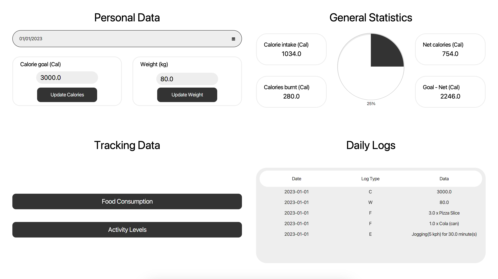
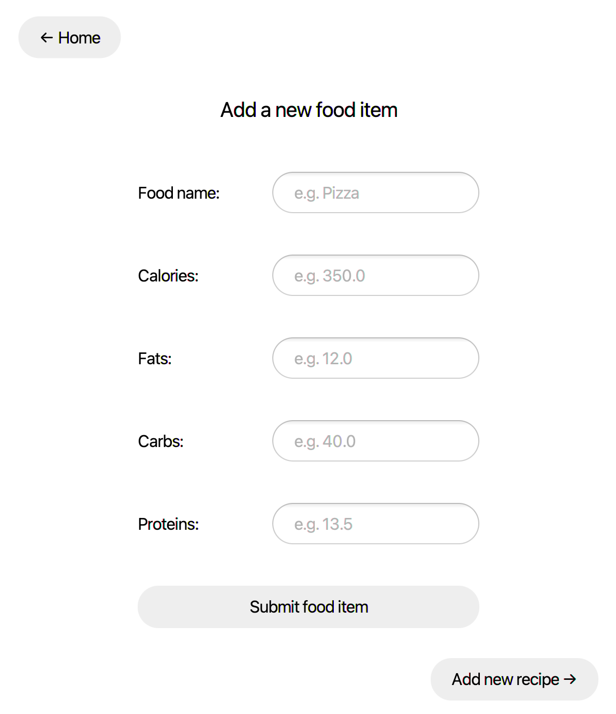
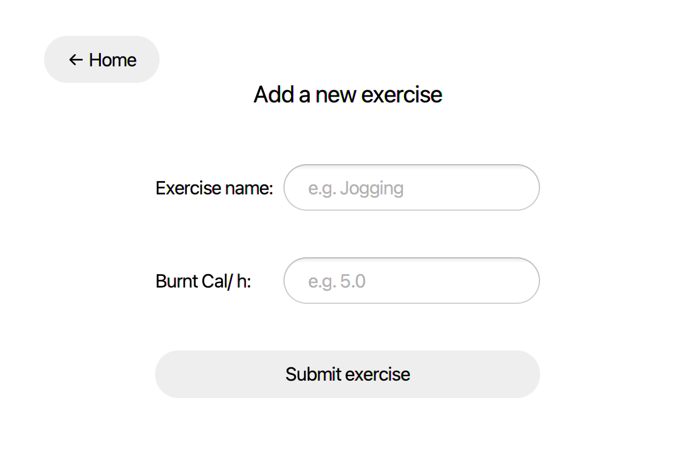

<!-- PROJECT -->
 
<h1 align="center">MunchiesManager</h3>

  
 

<!-- ABOUT -->
## About

MunchiesManager is a prototype Java application program that provides users with a collection of foods with their dietary information, which can be extended by users to include their own basic foods and recipes. The program allows users to record their exercises and deducts the calories expended on exercise from the calories consumed to compute net calories.

Each day, users can select the foods they consumed from the collection and enter the number of servings of each food. The program displays the totals for each of the distinct pieces of dietary information, as well as various graphics showing the composition of the day's diet in terms of fat, carbs, and protein.

Users can also periodically record their weight and set a desired caloric intake.

The data is saved in the CSV files, including the collection of foods, exercises, and users' food intake, weight, desired calorie limit, and daily exercises.

 

<!-- TECHNOLOGY -->
## Technology

* [![java][java]][java-url]
    
<!-- CONTACT -->
## Contact

[![linkedin][linkedin]][linkedin-url]
[![email][email]][email-url]

<!-- MARKDOWN LINKS & IMAGES -->
<!-- https://www.markdownguide.org/basic-syntax/#reference-style-links -->
[linkedin]: https://img.shields.io/badge/-LinkedIn-black.svg?style=for-the-badge&logo=linkedin&colorB=555
[linkedin-url]: https://www.linkedin.com/in/jurajstefanic/
[email]: https://img.shields.io/badge/email-555?style=for-the-badge&logo=gmail&logoColor=white
[email-url]: mailto:jurajstefanic@outlook.com
[java]: https://img.shields.io/badge/java-E34F26?style=for-the-badge&logo=&logoColor=white
[java-url]: https://www.java.com/